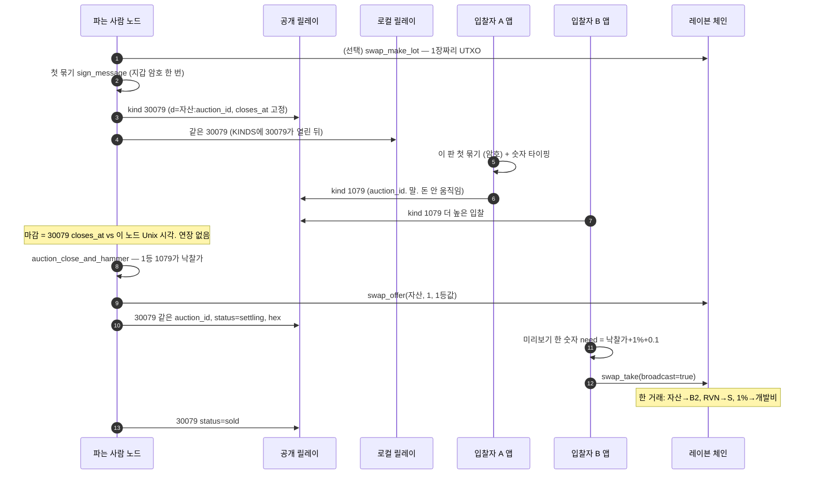
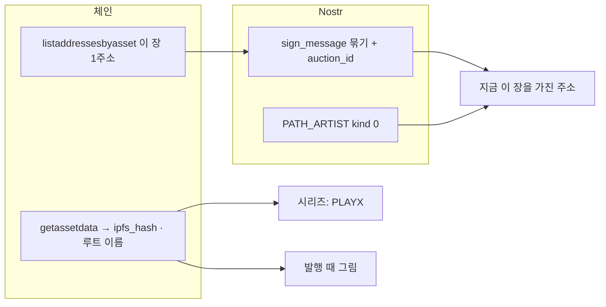
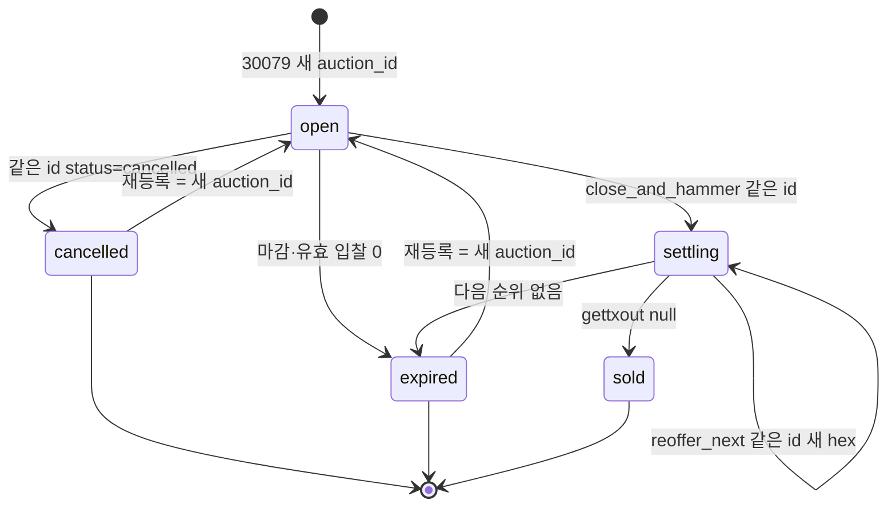

# PLAY X Raven — 자산 경매 설계

| 항목 | 값 |
|---|---|
| 저자 | PLAY X Raven |
| 날짜 | 2026-08-30 |
| 상태 | Draft |
| 저장소 | `/Users/gimmusong/build/playx-raven` |

대표님: 「경매도 있으면 어때? 물건 팔때 비싸게 팔고 싶은게 당연하지 않나?」
「경매가 되면 어떤 아티스트의 프로필인지 작품의 설명은 어떤지 등도 중요할듯 해」
「1% 받을수 있는 곳에 내가 최대한 받고 싶어」

---

## Overview

**결론: 입찰은 서명된 말(Nostr)이고, 돈은 마감 뒤 `swap_offer` 한 번 + 낙찰자 `swap_take`(1% 얹음)로만 움직인다. 에스크로 없다. 1차는 데스크톱만.**

고유 자산(`PLAYX#001` 같은 `#` 한 장)을 여럿이 부를 수 있게 한다. 한 판의 좌표는 불변 `auction_id`다. 진행 중에는 RVN도 자산도 체인에서 안 움직인다. 마감 뒤에야 파는 사람 노드가 로컬이 본 1등 1079를 낙찰가로 삼아 RIP-15 반쪽을 **한 번** 서명하고, 사는 사람은 이미 있는 `swap_take`로 완성한다. 개발비는 `shop::fee_config()`의 1%를 사는 사람이 얹는다 — 가게 POS처럼 파는 사람 몫을 깎지 않고, 중고 웹 `withDevFee`처럼 깎지도 않는다.

실물 중고 경매, 입찰마다 온체인 거래, 진행 중 `swap_offer` 갱신, 손님 웹 체결, 스나이프 연장은 1차에 넣지 않는다. 고정가 맞교환(`swap.rs`)과 NIP-99 중고(`kind 30402`)는 그대로 둔다.

---

## Background & Motivation

**결론: 고정가 맞교환은 이미 된다. 없는 것은 「여럿이 값을 올리는 말」과 그 말을 한 번의 스왑으로 받는 화면이다.**

지금 자산을 남에게 파는 길은 두 갈래다.

1. **벤딩** (`src-tauri/src/vending.rs`) — 손님이 먼저 RVN을 보내고 가게가 자산을 보낸다. 가게를 믿어야 한다. 오너 토큰(`!`)만 상품에서 뺀다. unique 경매 중 재고 제외는 없다.
2. **원자 스왑** (`src-tauri/src/swap.rs`) — 한 거래 안에서 동시. 파는 사람 `swap_offer`가 자산 입력 1 + RVN 출력 1에 `SIGHASH_SINGLE|ANYONECANPAY`로 서명하고, 사는 사람 `swap_take`가 RVN·자산·거스름·개발비를 붙여 방송한다.

스왑은 일대일이다. 값을 올리는 자리가 없다. 장터 탭의 `kind 30402`는 고정가 중고이고, 저장소에 `auction` / `경매` / `입찰` 문자열은 없다.

비수탁 선은 `noncustody.rs`가 시험으로 지킨다. 손님 돈을 우리가 잠깐이라도 받으면 전자금융업·가상자산사업자다. 경매는 그 선을 **설계로** 넘지 않는다.

1%는 끄는 스위치가 없다 (`shop.rs` `fee_config()`, 대표님 2026-08-23). `DESIGN.md` 「손님 금액에 영향 없음 / 99%가 판매자에게」는 **가게 POS** 설명이다. 웹 중고 `withDevFee`도 파는 사람 몫에서 뗀다 (`web/wallet.src.ts`). 스왑은 반대로 사는 사람이 얹는다. 경매 체결은 스왑이므로 스왑 모델을 따른다. 세 길을 한 문장에 묶지 않는다.

---

## Goals & Non-Goals

### Goals

- 고유 자산(`이름#태그`, 수량 1)을 오프체인 입찰로 팔고, 마감 뒤 기존 RIP-15 스왑 한 번으로 체결한다.
- 손님 화면(40~70대): 현재가 · 남은 시간 · 다음 최소 입찰. 16진수·sighash·UTXO 없음.
- 작품 설명은 Nostr 본문 + 태그. 이름표는 이미 있는 kind 0(아티스트 열쇠).
- 손님에게 보여주는 것: **시리즈(루트 이름)** + **지금 이 장을 가진 주소** + 그 주소에 묶인 이름표. 「만든 사람」사람 이름은 이 지갑이 `ROOT!`를 들 때만.
- 개발비 1%는 데스크톱 `swap_take` 한 경로에서만 걷는다. 새 수수료 코드를 만들지 않는다.
- 기존 고정가 스왑·NIP-99 중고·가게 POS는 동작·요율·주소를 바꾸지 않는다.

### Non-Goals

- 에스크로, 멀티시그 커스터디, 우리가 낙찰금을 받아 두는 구조.
- 실물 중고 경매 (1차). 실물은 지금처럼 30402 고정가 + 현장/맞교환.
- 입찰마다 온체인 트랜잭션.
- 진행 중 `swap_offer`를 가격마다 새로 서명해 뿌리는 것.
- 스나이프 연장 (1차). 마감 시각은 올린 값 그대로.
- 손님 웹에서 입찰·체결 (1차). 웹은 「이 컴퓨터 앱에서」안내만. `withDevFee` 재사용 없음.
- 하위 수량 자산(`PLAYX/앨범`, 여러 장) 경매 — 묶음 UTXO(`exact_outpoint`)가 장마다 달라 1차에서 빼다.
- `PLAYX!` 소유토큰 경매 — 발행 권한이지 팔 물건이 아니다 (`fanclub.rs`, `vending.rs`).
- 로컬 릴레이에 kind 0 또는 kind 1079를 여는 것.
- 보증금.

---

## Key Decisions

1. **입찰은 말, 체결은 스왑 한 번 (Q1 다).** 진행 중 서명된 Nostr 이벤트(+ 주소 `sign_message`)만 쌓는다. 돈은 안 묶인다. 마감 후 파는 사람이 `swap_offer` 한 번, 낙찰자가 `swap_take`. (가)(나)는 Alternatives에서 패배.
2. **불변 `auction_id`.** 한 판의 좌표. 30079·1079·`bind_message`에 들어간다. 1등은 **그 id + 유효 서명**만 센다. 연장(1차엔 없음)·status·hex는 **같은 id**. 취소·만료 후 재등록은 **새 id**. 30079의 NIP-33 `d` = `{asset}:{auction_id}`. **1079의 `d` = `{auction_id}`만** (regular라 같은 `d`로 덮이지 않음). 조회는 한 글자 태그 `#d`만 (`nostr_query_tag`). `["auction", id]` 같은 두 글자 이상 태그 이름은 색인되지 않는다.
3. **낙찰자가 안 내면 자산은 파는 사람 것.** 보증금이 답이 아니다. 「다음 순위에게 제안」은 **한 명령**: 자기에게 `transfer` → 확인(`gettxout` null) → 새 `swap_offer`. hex 태그는 확인 뒤에만.
4. **체결 경로는 데스크톱 `swap_take` 하나.** 요율·주소는 `shop::fee_config()`. 미리보기 한 숫자 `need = 낙찰가 + 1% + 0.1`(`swap.rs` `FEE`). POS 깎기·웹 `withDevFee`와 섞지 않는다.
5. **hammer 가격의 정본은 로컬이 본 1등 1079.** 화면이 보낸 `expected_price`와 다르면 거절. 호출자가 임의 가격으로 `swap_offer` 못하게 한 명령 `auction_close_and_hammer`가 마감·status·1등 대조를 한다.
6. **시작가 하한 1 RVN.** 1%가 0.01 RVN 미만이면 `swap_take`가 개발비 출력을 건너뛴다.
7. **최소 입찰 단위 `max(1 RVN, ceil(현재가 × 5%))`.**
8. **이벤트 종류를 30402와 나눈다.** 경매 글 `kind 30079`(NIP-33), 입찰 `kind 1079`(일반). `shopkey.rs`가 30402 재사용을 이미 금지한다.
9. **1079는 로컬 `KINDS`에 넣지 않는다.** 입찰은 공개 릴레이만. 30079는 경매 UI PR에서만 로컬에 열고, 넘칠 때 **30078은 남기고** 다른 오래된 것부터 버린다. 30079 상한 200. `t=playx` 필터는 30079에만. 30078 간판은 `d`+`expiration`뿐이라 전 종류에 표를 요구하면 가게 공지가 거절된다.
10. **설명은 Nostr, 원본 그림은 체인 IPFS 한 번.**
11. **프로필은 공개 릴레이 kind 0.** 로컬 `KINDS`에 0을 넣지 않는다.
12. **30079는 `artist_key()`(12단어 → `PATH_ARTIST`). 없으면 경매 칸을 숨긴다.** 카피: 「12단어가 있는 지갑에서만」. `identity.rs` `artist_key()`는 노드 12단어를 못 읽으면 `None`(388–390행). 이야기 열쇠로 떨어지지 않는다. **1079는 이 컴퓨터의 실제 이야기 열쇠**(`talk.rs` `key()`: **파일이 있으면 파일이 이긴다**, 60–61행). PATH_PERSON과 다를 수 있다. 이름표는 **그 1079 pubkey의 kind 0**. `auction_bind_sign`은 nostr_pk를 호출자에게 받지 않는다 — 30079면 `artist_key()` 공개키, 1079면 `talk::key()` 공개키를 문장에 넣는다. 체인 자산에 아티스트 키를 박는 것(재발행)은 전제가 아니다.
13. **손님 라벨.** 「시리즈: PLAYX」+ 현재 보유 주소 + 묶인 이름표. 「이 컴퓨터가 발행함」은 **이 지갑이 `ROOT!`를 들 때만**. 2차에 발행자 보증 배지 없음. 원격 손님에게 `PLAYX!` 주소 명단을 풀지 않는다.
14. **제안 hex는 마감 전에 릴레이에 올리지 않는다.** `ANYONECANPAY`라 옛 낮은 값이 살아 있으면 가로채기다.
15. **마감 후 hex는 공개돼도 파는 사람은 안 다친다(같은 낙찰가).** 낙찰가 자체를 화면이 속이는 것은 14와 별개이며 5가 막는다. 바이어 묶는 sighash는 1차에서 안 만든다.
16. **스나이프 연장 없음 (1차).** `closes_at`은 올린 값. 「화면이 연장」은 구현이 아니다. 나중에 넣을 거면 파는 사람 노드 타이머(앱이 켜져 있을 때만)로 다시 설계한다.
17. **첫 묶기만 지갑 암호.** 이후 같은 `(주소, 아티스트/사람 키, 자산, auction_id)` 입찰은 Nostr만. 카피: 「이 주소가 내 것임을 한 번 증명합니다. 잔액은 안 줄어듭니다.」
18. **마감·24h 미체결의 시계는 파는 사람 노드.** `closes_at`·`settling_at`은 Unix 초. 손님 화면의 남은 시간은 추정. 분쟁 시 hammer 명령이 노드 시각으로 판정한다.
19. **`-assetindex` 필수.** 꺼져 있으면 경매 칸을 숨기고 `fanclub.rs` `FIX_INDEX`와 같은 안내.
20. **같은 unique에 open/settling 30079가 있으면** 두 번째 경매 거절, `swap_offer` 거절, 벤딩 재고에서 제외. 30402는 지금 자산 태그가 없어 자동 거절 불가 — 화면에 「장터 고정가 글이 있으면 내리세요」만.
21. **1차 입찰·체결은 데스크톱만.** `sign_message`와 `swap_take`가 노드 지갑을 쓴다. 손님 웹은 범위 밖.
22. **실물 경매는 나중에.**
23. **플래그 `features.json` `"auction": false`가 기본.** 켜는 주체는 PR 6(내부에서 체결 tx 개발비 출력을 눈으로 확인한 뒤 `"auction": true`).

---

## Proposed Design

### Q1. 경매를 어떻게 성립시키나?

**결론: (다) 혼합. 진행 = 서명된 말. 체결 = 마감 뒤 `auction_close_and_hammer` 1회 + `swap_take`. 에스크로 없음. 낙찰자가 안 내면 자산은 안 나간다.**



**왜 이 순서인가.** `swap_offer`는 특정 사는 사람에게 묶이지 않는다.

```16:19:src-tauri/src/swap.rs
//! 파는 쪽 :  입력0 = 내 자산      출력0 = 내가 받을 RVN
//!            여기까지만 서명한다 (SIGHASH_SINGLE | ANYONECANPAY)
//!            = 「이 입력은 내 것이고, 0번 출력은 나에게 온다.
//!               나머지 입력·출력은 누가 붙여도 좋다」
```

서명 플래그:

```213:216:src-tauri/src/swap.rs
    let signed = call_rpc(
        "signrawtransaction",
        json!([raw, Value::Null, Value::Null, "SINGLE|ANYONECANPAY"]),
```

같은 자산 UTXO로 서명한 **옛 낮은 가격 hex는 그 UTXO가 쓰이기 전까지 살아 있다.** 진행 중에 가격마다 `swap_offer`를 뿌리면(가) 누구든 옛 값으로 가로챈다. 입찰자마다 서명 스왑 hex를 올리면(나) 입찰자의 RVN UTXO가 묶이거나, 잘못 누른 1,000 RVN이 진짜 돈이 된다. 40~70대에 최악이다.

(다)에서 입찰은 `walletx.rs`의 `sign_message` / `verify_message`와 Nostr 이벤트 서명이다. 둘 다 글자다. `swap_take`를 누르기 전에는 잔액이 안 줄어든다. `sign_message`는 지갑이 잠겨 있으면 `walletpassphrase`가 필요하다 (`walletx.rs` 31–41행). 그래서 **첫 묶기만** 암호를 묻고, 그 서명을 이 `auction_id`에 재사용한다. 이후 입찰 단추는 Nostr 열쇠만 쓴다.

**낙찰자가 안 내면.** 자산 UTXO는 아직 파는 사람 것이다. `settling_at + 24h`(파는 사람 노드 시계) 안에 `gettxout`이 살아 있으면 「다음 순위에게 제안」 한 단추가 켜진다. 그 단추는 `auction_reoffer_next` **하나**다. 화면이 `swap_offer`를 다시 부르지 못한다.

`auction_reoffer_next(auction_id, passphrase)` 순서:

1. 이 노드가 올린 30079, 같은 `auction_id`, `status=settling`.
2. 1등 1079를 제외한 다음 유효 입찰을 고른다. 없으면 `status=expired`, hex 태그 제거, 끝.
3. unique 1장을 새 주소로 `transfer` (옛 outpoint 사망).
4. 옛 `gettxout`이 null이 되고 `swap_ready`가 1장 묶음을 줄 때까지 기다린다 (확인 보통 1–2분, `swap_make_lot` 주석과 같음). 확인 전에 hex 태그를 올리지 않는다.
5. 시험이 4를 강제: 두 번째 `swap_offer` 전에 옛 txid/vout의 `gettxout` is_null.
6. 새 주소로 **같은 `auction_id` bind를 다시** 한다(`artist_key()` 공개키 + 새 주소). 호출자가 pk를 넘기지 않는다. 지갑 암호는 이 명령이 이미 받은 것.
7. `swap_offer(자산, 1, 다음값)`. 30079는 **같은 `auction_id`/`d`**. `price`·`hex`와 함께 **`addr`/`sig`를 새 주소 묶기로 덮어쓴다.** 확인 전에는 hex·새 sig를 올리지 않는다.

재등록(취소·만료·sold 이후 새로 팔기)은 **새 `auction_id`**. 지난 판 1079는 1등 후보가 아니다.

보증금은 안 받는다. 받는 순간 우리가 돈을 만지거나, 잠긴 UTXO를 우리가 해석하는 보관에 가까워진다.

### Q2. 1%를 경매에서 어떻게 확실히 받나?

**결론: 경매 체결 UI는 `swap_take`만 부른다. 요율은 `fee_config()`. 새 수수료 경로를 만들지 않는다. hammer는 1등 1079라서 낮은 값으로 1%를 줄이지 못한다. 시작가 ≥ 1 RVN으로 `fee_dev < 0.01` 스킵을 닫는다.**

스왑은 파는 사람 값을 깎지 않고 사는 사람이 얹는다.

```305:322:src-tauri/src/swap.rs
    // 🔴 개발비 1%. **파는 사람이 부른 값은 그대로 간다** — 0번 출력은 파는
    //    사람이 이미 서명해 둔 것이라 우리가 줄일 수 없다. 그래서 사는 쪽이
    //    1% 를 얹어 낸다.
    //
    //    줄이는 쪽(파는 사람이 99% 만 받게)으로 만들면, 우리 앱이 아닌 다른
    //    프로그램으로 사는 사람이 나타났을 때 **파는 사람만 1% 를 조용히
    //    잃는다.** 얹는 쪽은 그런 일이 없다 — 못 걷을 뿐 아무도 안 다친다.
    let (rate, fee_addr) = crate::shop::fee_config();
    let fee = (price * rate * 1e8).round() / 1e8;
```

`swap_check`가 돌려주는 `total`은 `price + fee`이고 **네트워크 `FEE`(0.1)가 없다.**

```315:322:src-tauri/src/swap.rs
    Ok(json!({
        "ok": true,
        "asset": asset,
        "amount": amount,
        "price": price,
        "fee": fee,
        "fee_address": fee_addr,
        "total": price + fee,
```

`swapLook`의 「모두」는 이 `total`이라 0.1이 빠진다. `swapBuy`의 `sure()`만 `dry.fee`를 붙인다. **경매 미리보기는 `swapLook`의 「모두」를 복제하지 않는다.** 한 숫자: `need = price + fee_dev + 0.1`. 예: 「내실 돈 **1,010.1 RVN** (낙찰 1,000 + 이용료 10 + 체인 0.1). 되돌릴 수 없습니다.」

```405:412:src-tauri/src/swap.rs
    // 개발비 1%. **같은 거래 안에서 나간다** — 따로 쌓았다가 나중에 보내는
    // 길(가게 주문이 그렇다)은 여기서 쓸 수 없다. 이건 우리 노드를 거치지
    // 않는 거래라, 지금 안 넣으면 걷을 자리가 영영 없다.
    //
    // 0.01 RVN 미만이면 넣지 않는다 — 보내는 수수료가 더 나온다.
    if fee_dev >= 0.01 && !fee_addr.is_empty() {
        outs.insert(fee_addr.clone(), json!(fee_dev));
    }
```

가게 POS는 반대다. 손님은 메뉴 가격을 그대로 내고 가게가 99% 받는다 (`shop.rs` 머리 주석, `DEFAULT_FEE_RATE = 0.01`, 주소 `RLFnbkjmf1VCVq7D9TZvRp7fv6W97rm2cB`). 웹 중고도 깎기다:

```564:598:web/wallet.src.ts
 * 개발비 몫(사토시). **물건값에서 나온다 — 위에 얹지 않는다.**
...
  const toGets = devOk ? sel.amount - dev : sel.amount;
```

경매에 `withDevFee`를 쓰면 낙찰가에서 1%를 깎고 unique가 원자적으로 안 넘어간다. **1차 웹 체결 없음. 데스크톱 `swap_take`만.**

**구멍과 막기**

| # | 구멍 | 막는 법 | 남는 것 |
|---|---|---|---|
| 1 | 우리 앱이 아닌 클라이언트가 최종 hex를 완성 | 스왑 주석이 인정. 파는 사람은 낙찰가 전액. 못 걷을 뿐 | 포크·외부 지갑. 막는 순간 거래소가 된다 |
| 2 | 진행 중 옛 제안 hex 유출 | 마감 전 `swap_offer` 금지(러스트). 30079에 hex 태그 금지. `swap_offer`가 이 지갑의 open/settling 30079 unique면 거절 | 다른 프로그램이 같은 지갑 RPC를 쓰면 못 막음 |
| 3 | `fee_dev < 0.01` 스킵 | 시작가 하한 1 RVN → 1% = 0.01. 입찰 단위도 1 RVN 이상 | 하한을 우회하는 포크 |
| 4 | `swap_take` 밖(직접 `transfer` / 벤딩) | 경매 「사기」는 미리보기 → `swap_take`만. `sellable_assets`가 open/settling unique를 빼고, 시험이 그걸 지킴 | 두 사람이 체인 밖에서 합의하면 못 걷음 — POS와 같은 선 |
| 5 | 포크 앱 | 끄는 스위치를 코드에 두지 않음 (`fee_config`가 옛 `fee.json` `on: false`를 무시) | 오픈소스의 한계 |
| 6 | 파는 사람이 낙찰가보다 낮은 hex를 올림 | `auction_close_and_hammer`가 1등 1079와 `expected_price`를 대조. 불일치 거절. 가격 인자만으로 `swap_offer`하는 공개 명령을 경매 UI에 두지 않음 | 맞교환 칸·외부 클라가 같은 UTXO를 쓰면 2가 거절. 거절을 UI에만 두면 우회됨 → 러스트 |
| 7 | 웹 `withDevFee`로 깎으며 자산 없이 결제 | 1차 웹 체결 없음. 중고 깎기와 스왑 얹기를 한 경로로 안 묶음 | 2차 웹은 RIP-15 얹기를 **따로** 설계해야 함. 이 문서 범위 밖 |
| 8 | `swapLook` 「모두」가 0.1을 빼 보여 줌 | 경매 미리보기는 `need` 한 숫자. `total` 필드를 「내실 돈」으로 쓰지 않음 | 맞교환 칸의 기존 「모두」는 그대로 (이 설계가 안 고침) |

경매 전용 수수료 장부·별도 주소를 만들지 않는다. `swap.rs` 시험 `맞교환에도_개발비가_들어간다`(544–554행)가 `swap_take` 출력을 지킨다. 경매는 그 함수만 부르므로 그 시험이 경매 1%도 지킨다. 추가로: 경매 모듈이 `swap_take` 이외의 방송 경로를 갖지 않는다는 소스 시험.

### Q3. 작품 설명과 아티스트 프로필을 어디에 두나?

**결론: 설명은 30079 본문·태그. 사진은 IPFS. 체인 `ipfs_hash`는 발행 때 한 번. 이름표는 `PATH_ARTIST`의 kind 0을 공개 릴레이에서 읽는다. 손님 1차 라벨은 시리즈 + 현재 보유 주소 + 묶인 이름표다. 「만든 사람」사람 이름을 원격에 지어내지 않는다.**

`web/nostr.ts`가 이미 자리를 나눠 두었다: 체인 = 가게 신원과 돈, Nostr = 물건·문의, IPFS = 사진. 경매도 이 셋을 따른다.

**설명.** 30079 `content` JSON의 `title`·`about`과 태그 `title`. 같은 글쓴이·kind·`d`면 NIP-33 덮어쓰기. `d`에 `auction_id`가 들어가므로 재등록은 새 칸이다. 체인 메타데이터는 재발행 소각이라 설명 저장소로 쓰지 않는다. 영구 원본이 필요하면 발행 시 `ipfs_hash` 한 번 (`getassetdata` → `server.rs` `api_chain_asset`).

**사진.** IPFS CID를 30079 `image` 태그에. 공개 게이트웨이(ipfs.io)는 504를 낸 적이 있다 (`relay.rs` 머리 주석). 데스크톱은 `http://127.0.0.1:8080/ipfs/<cid>`를 먼저 (`DESIGN.md`). 체인 `ipfs_hash`와 같으면 「발행 때 붙인 그림」, 다르면 「파는 사람이 붙인 그림」.

**프로필.** `talk.rs` `KIND_PROFILE = 0`. 로컬 `KINDS`는 `[30078, 30402, 40, 42, 1]`이고 **0이 없다. 그대로 둔다.** 이름표는 `nostr_query_authors`. 없으면 16진수 앞자리 — 없는 이름을 지어내지 않는다.

**서명 열쇠.** 30079는 `artist_key()`만. 12단어가 없으면 칸 숨김(「12단어가 있는 지갑에서만」). 1079는 `talk.rs` `key()` — 파일에 든 이야기 열쇠가 PATH_PERSON이 아니어도 **그 열쇠로 서명**하고, 이름표도 그 pubkey의 kind 0. 경매 글쓴이(아티스트 키) kind 0은 따로다. 가게 간판 30078 열쇠로 경매를 쓰지 않는다. `auction_bind_sign`에 nostr_pk 인자 없음.



- **시리즈.** unique `PLAYX#001`의 루트 `PLAYX` (`raven.rs`가 `/`·`#`로 자름). 합의 규칙상 unique는 루트 오너 토큰 없이 발행 불가 (`issue.rs` `classify`, 소각 5 RVN). 자산 이름이 위조 불가다. 그걸 「이 사람이 그렸다」로 번역하지 않는다.
- **지금 보유.** `listaddressesbyasset(name, false)`로 주소 0~1개. 팬클럽 `fan_holders`는 `onlytotal`+주소 목록 비공개라 **재사용하지 않는다.** `-assetindex`가 꺼지면 거절 문장이 정상 응답으로 온다 (`fanclub.rs` 637–643행). 경매 칸은 그때 숨기고 `FIX_INDEX`를 띄운다.
- **`auction_issuer`.** `getassetdata` + **이 지갑**의 `ROOT!`(`list_assets` `mine`). 손님 원격 API가 아니다. 이 컴퓨터 화면이 `mine == true`일 때만 「이 컴퓨터가 이 시리즈를 발행함」. `getassetdata`는 발행자 주소를 안 준다. 현재 `PLAYX!` 보유자는 발행 권한이 넘어간 뒤의 사람이라 「원작자」가 아니다.
- **묶기 문장(고정).** `PLAYX-AUCTION|{nostr_pubkey_hex}|{asset}|{rvn_address}|{auction_id}`. pk는 명령이 열쇠에서 넣는다. 한 서명을 다른 판·다른 주소에 붙이지 못한다. `reoffer_next`가 주소를 옮기면 **같은 명령 안에서** 새 주소로 다시 서명한다. 검증은 `verify_message`(지갑 잠겨 있어도 됨).
- **2차.** 발행자가 보증하지 않는다. 보증 배지 없음.

### Q4. 화면 (40~70대)

**결론: 손님에게 숫자 셋 — 현재가, 남은 시간, 다음 최소 입찰. 입찰은 말임을 적고, 첫 묶기만 지갑 암호, 숫자는 직접 타이핑. hex는 숨긴다. 사는 단추는 `swap_take(broadcast=false)` 미리보기이나 「모두」줄은 복제하지 않는다.**

사이드바는 그대로다. 경매는 **자산 화면**의 맞교환 칸 옆 `details`로 접어 둔다. 새 `data-page` 없음. `-assetindex`가 없거나 플래그가 꺼지면 칸 자체를 그리지 않는다.

**손님(입찰·낙찰 후 사기) — 1차는 이 컴퓨터 앱**

| 보여 줌 | 숨김 |
|---|---|
| 작품 제목·설명·사진 | hex, sighash, UTXO, txid |
| 시리즈: PLAYX · 지금 이 장을 가진 주소 · 묶인 이름표 | 릴레이 URL |
| 「이 컴퓨터가 발행함」 — `ROOT!`를 들 때만 | 원격에서 지어낸 「만든 사람」 |
| 현재가 · 남은 시간(추정) · 다음 최소 입찰 | 「SIGHASH_SINGLE」 |
| 「이 숫자는 약속입니다. 지금 잔액은 안 줄어듭니다.」 | 1%를 숨긴 채 총액만 — 금지 |
| 이 판 첫 묶기: 「이 주소가 내 것임을 한 번 증명합니다. 잔액은 안 줄어듭니다.」 | 송금 확인 모달로 묶기 |
| 입찰 확인: 숫자를 **직접 타이핑** | |
| 낙찰 후 한 숫자: 내실 돈 = 낙찰가+1%+0.1 | `swapLook`의 「모두」(0.1 없음) |

최소 단위: `next = current + max(1, ceil(current × 0.05))` RVN 정수. 그보다 낮으면 단추가 안 눌린다. 현재가 대비 2배 이상이면 「지금 값의 N배입니다」를 한 줄 더.

**파는 사람**

- 고를 자산: 내가 가진 unique만. 이미 open/settling인 unique는 목록에서 빠짐.
- 시작가(≥ 1 RVN) · 마감(기본 24시간, 고르기: 6시간 / 24시간 / 3일 / 7일). **연장 없음. 적은 시각이 끝.**
- 지금 1등(이름표 + 값). 없으면 「아직 없습니다」.
- 단추 「낙찰가로 제안 만들기」 → `auction_close_and_hammer`. 화면이 계산한 1등을 `expected_price`로 보내고, 노드가 다시 센 값과 다르면 거절 문구. 지갑 암호는 여기와 첫 묶기.
- 그 전에 1장 묶음이 없으면 `swap_make_lot`을 먼저 (`SIGHASH_SINGLE`이 0번 출력만 붙잡음).
- 마감 전 내리기: 같은 `auction_id`로 `status=cancelled`. 「말은 남아 있습니다. 돈은 안 움직였습니다.」 kind 5는 부탁. 정본은 status.
- 미체결 24h 뒤: 단추 하나 「다음 분에게 제안」 → `auction_reoffer_next`. 진행 중 「기다리는 중…」(확인).

### Q5. 실물 중고 경매는?

**결론: 지금 넣지 않는다. Non-goal.**

자산은 스왑으로 동시 교환이 된다. 실물은 낙찰 후 안 내면 그만이다. 보증금을 걸게 하면 어르신이 못 쓰고, 우리가 그 돈을 받으면 보관에 가깝다. 실물은 기존 30402 고정가 + (있으면) 맞교환/현장.

---

## 이벤트 스키마

**결론: 30402를 재사용하지 않는다. 한 판의 좌표는 불변 `auction_id`. 1등은 그 id로만 센다.**

```57:65:src-tauri/src/shopkey.rs
/// 🔴 30000–39999 는 **덮어쓰기 가능한(parameterized replaceable)** 구간이다
/// (NIP-33). 같은 글쓴이·같은 종류·같은 `d` 태그면 릴레이가 **옛것을 지우고**
/// 새것만 남긴다. ...
/// 🔴 30402 를 쓰면 안 된다. 그건 이미 **파는 물건**이 쓰고 있다
/// (`web/nostr.ts`, `web/shops.src.ts`). 같은 번호를 쓰면 가게 주소 공지가
/// 물건 목록에 섞여 나온다.
```

| kind | 이름 | NIP-01 구간 | 역할 | 로컬 저장 |
|---|---|---|---|---|
| **30079** | `KIND_AUCTION` | parameterized replaceable | 한 판. `d` = `{asset}:{auction_id}` | UI와 같이 연 뒤. 30078 우선 보존 |
| **1079** | `KIND_BID` | regular | 입찰 한 줄 | **안 함.** 공개 릴레이만 |
| 5 | (기존) | regular | 내림 부탁 | 기존 규칙 |
| 0 | (기존) | replaceable | 이름표 | 안 함 |

`auction_id`: 16자 소문자 hex. 새 판마다 새로. status/hex 갱신은 같은 값.

공개 릴레이의 다른 앱 30079는 한 글자 태그로만 건다: `t=playx`(또는 `t=auction`) + `asset` 태그에 unique `#`. 두 글자 이름 `auction` 태그는 색인하지 않는다.

### kind 30079 — 경매 글

`content`는 JSON. 로컬에 열리면 `smells_bad`가 JSON과 `d`의 자산 모양을 요구한다. `d` = `PLAYX#001:a1b2c3d4e5f67890`이면 `looks_like_asset`의 core는 `#` 앞 `PLAYX`.

```json
{
  "title": "봄 1",
  "about": "2026년 수채. 한 장뿐입니다.",
  "start": 100,
  "closes_at": 1780000000,
  "asset": "PLAYX#001",
  "auction_id": "a1b2c3d4e5f67890"
}
```

`extend_sec` 없음 (1차 연장 없음).

태그:

```
["d", "PLAYX#001:a1b2c3d4e5f67890"]  // NIP-33 칸. 조회는 글쓴이 또는 이 #d
["title", "봄 1"]
["asset", "PLAYX#001"]
["start", "100", "RVN"]
["closes", "1780000000"]
["status", "open"]          // open | settling | sold | cancelled | expired
["t", "playx"]
["t", "auction"]
["addr", "R..."]
["sig", "<sign_message>"]
["pk", "<artist_key() 공개키>"]
["image", "ipfs://<cid>"]
["image_onchain", "1"]      // 체인 ipfs_hash 와 같을 때만
```

정산 중일 때만 (같은 `d`/`auction_id`):

```
["status", "settling"]
["price", "<hammer>", "RVN"]
["settled_at", "<unix>"]
["hex", "<raw swap offer>"]   // 마감 전·확인 전 금지
```

### kind 1079 — 입찰

공개 릴레이만. 1등·hammer의 조회 좌표는 **한 글자 태그 `d` = `auction_id`**. NIP-01 `#` 필터와 `nostr_query_tag`는 태그 이름이 한 글자일 때만 받는다.

```234:237:src-tauri/src/nostrpub.rs
    // 한 글자짜리 태그만 쓴다(NIP-01). `t`(표)·`e`(가리키는 글) 같은 것.
    if tag.len() != 1 || !tag.chars().all(|c| c.is_ascii_alphabetic()) {
        return Err("태그가 올바르지 않습니다.".into());
```

`nostr_query`는 authors가 없으면 거절한다(158–173행). 입찰자는 미리 모르는 사람이라 authors로 못 긁는다. 1079는 로컬 `KINDS`에도 없다. 그래서 **`["auction", id]` 같은 두 글자 이상 이름은 1등 좌표가 될 수 없다.** 시험 전제: `nostr_query_tag(..., tag: "auction", ...)`는 거절.

`content` JSON:

```json
{
  "asset": "PLAYX#001",
  "auction_id": "a1b2c3d4e5f67890",
  "amount": 105,
  "note": "이 글은 약속입니다. 체인에서 돈이 나가지 않습니다."
}
```

태그:

```
["d", "a1b2c3d4e5f67890"]     // 1등 좌표 = auction_id. 1079는 regular → NIP-33 덮어쓰기 없음
["asset", "PLAYX#001"]
["amount", "105", "RVN"]
["addr", "R..."]
["sig", "<bind of PLAYX-AUCTION|pk|asset|addr|auction_id>"]
["pk", "<실제 이야기 열쇠 pubkey>"]
["t", "playx"]
["t", "auction"]
```

30079의 `d`는 `{asset}:{auction_id}`(덮어쓰기 칸). 1079의 `d`는 `{auction_id}`만. 종류가 달라 같은 릴레이에서 섞이지 않는다.

`e`(현재 30079 id)로 모으면 status 한 번에 고아가 된다. 자산 이름만의 `d`/`a`로 모으면 재등록 때 옛 입찰이 산다. **둘 다 쓰지 않는다.**

화면 1등과 `auction_close_and_hammer`는 같은 호출:

```
nostr_query_tag(kinds=[1079], tag="d", values=[auction_id], limit=200)
```

그 목록에서 `verify_message` 통과, `amount` 최대, 동점이면 `created_at` 빠른 쪽. `#t=auction`으로 전 세계 200개를 받아 거르지 않는다(`limit`이 `clamp(1, 200)`이라 다른 판에 잘린다).

같은 사람이 값을 올리면 새 1079(같은 `d`여도 regular라 둘 다 남음). 옛 것은 기록.

시험: (1) 같은 id로 30079 status를 settling으로 덮은 뒤 `#d=id` 1등이 같다. (2) 취소 후 새 id로 올리면 옛 `#d` 질의 0건. (3) 태그 이름 2글자 이상은 `nostr_query_tag` 거절.

### 로컬 릴레이

지금:

```64:73:src-tauri/src/relay.rs
const KINDS: [i64; 5] = [30078, 30402, 40, 42, 1];
...
const TALK_KINDS: [i64; 3] = [40, 42, 1];
...
const MAX_EVENTS: usize = 5_000;
```

`nostr_publish`는 로컬을 **맨 앞**에 둔다:

```21:32:src-tauri/src/nostrpub.rs
/// 올릴 곳 전부 — **우리 릴레이를 맨 앞에.**
fn targets() -> Vec<String> {
    let mut out = vec![format!("ws://127.0.0.1:{}/api/relay", crate::server::PORT)];
    out.extend(RELAYS.iter().map(|s| s.to_string()));
```

넘치면 종류를 안 가리고 `drain`한다. 한 연결 200개 상한은 재접속으로 우회된다 (`relay.rs` 461–465행 주석이 간판이 밀리는 사고를 적음).

**1차 결정**

- **1079를 `KINDS`에 넣지 않는다.** 90일 누적 regular가 5,000을 먹고 30078을 민다. 입찰 정본은 공개 릴레이 세 곳.
- **30079는 경매 UI와 같은 PR에서만** `KINDS`에 추가. 순수 규칙 PR에서 미리 열지 않는다.
- 30079 `smells_bad`: JSON + `looks_like_asset(d)` + (`t=playx` 또는 `t=auction`) + `asset` 태그에 `#`. **이 추가 조건은 kind==30079일 때만.** 30078 간판 태그는 `d`와 `expiration`뿐 (`shopkey.rs` 384–389행). 전 종류에 `t=playx`를 요구하면 가게 공지가 거절된다.
- 5,000을 넘기면 **kind 30078은 남기고** 다른 오래된 것부터 버린다. 30079 상한 200개(덮어쓰기라 산 경매 수에 가깝다).
- kind 0은 여전히 안 넣는다.
- 시험: `assert!(!KINDS.contains(&1079))`, `assert!(!TALK_KINDS.contains(&1079))`, 30078 이벤트는 `t` 없이 저장.

---

## API / Interface Changes

**결론: `swap_ready`/`swap_make_lot`/`swap_check`/`swap_take` 시그니처는 불변. `swap_offer` 본문에 open-경매 거절 한 줄. hammer는 가격을 복음으로 받지 않는 한 명령.**

새 모듈 `src-tauri/src/auction.rs`:

```rust
pub const MIN_START_RVN: f64 = 1.0;
pub const BIND_PREFIX: &str = "PLAYX-AUCTION";

pub fn min_next(current: f64) -> f64 {
    let step = (current * 0.05).ceil().max(1.0);
    current + step
}

pub fn is_unique_asset(name: &str) -> bool {
    let n = name.trim();
    n.contains('#') && !n.starts_with('#') && !n.ends_with('!')
}

pub fn bind_message(nostr_pk: &str, asset: &str, addr: &str, auction_id: &str) -> String {
    format!("{BIND_PREFIX}|{nostr_pk}|{asset}|{addr}|{auction_id}")
}

pub fn rank_top<'a>(bids: &'a [Bid], auction_id: &str) -> Option<&'a Bid> { /* 1079 d 태그 = id + 서명 */ }

pub fn preview_need(price: f64, rate: f64) -> f64 {
    let fee = (price * rate * 1e8).round() / 1e8;
    price + fee + crate::swap::FEE
}
```

`FEE`는 지금 `swap.rs` 53행 `const FEE: f64 = 0.1`(private). **PR 1에서 `pub(crate) const FEE`로만 연다.** 값 0.1을 `auction.rs`에 복제하지 않는다.

| 명령 | 하는 일 |
|---|---|
| `auction_min_next(current)` | 다음 최소 |
| `auction_bind_sign(address, asset, auction_id, passphrase)` | nostr_pk 인자 없음. 30079면 `artist_key()`, 1079면 `talk::key()`의 공개키를 문장에 넣음. 같은 (주소, 그 pk, 자산, id) 서명은 앱이 재사용 |
| `auction_bind_verify(...)` | `verify_message` |
| `auction_holder(asset)` | unique 현재 주소 0~1개. 색인 없으면 `FIX_INDEX` |
| `auction_issuer_local(asset)` | 이 지갑 `ROOT!` 여부 + `getassetdata`. 원격 이름 없음 |
| `auction_bids(auction_id)` | `nostr_query_tag(kinds=[1079], tag="d", values=[id], limit=200)` 래퍼. 화면 1등과 hammer가 같이 씀 |
| `auction_close_and_hammer(auction_id, expected_price, passphrase)` | 아래 |
| `auction_reoffer_next(auction_id, passphrase)` | transfer→확인→새 주소 bind→offer. 확인 전 hex·새 sig 없음 |
| `auction_balance_hint(address)` | 선택, 기본 화면 끄기. `publicbook::address`, `trusted: false` 통과 |
| `auction_open_assets()` | 이 지갑이 올린 open/settling unique 이름 목록. `swap_offer`·벤딩이 조회 |
| `auction_can_list()` | `artist_key().is_some()`. false면 칸 숨김 + 「12단어가 있는 지갑에서만」 |

**`auction_close_and_hammer` (한 명령)**

1. 이 노드 Unix 시각 ≥ `closes_at`. 아니면 거절.
2. 30079가 이 지갑 `artist_key()` 글, `auction_id` 일치, `status=open`.
3. `auction_bids(id)` = `nostr_query_tag(kinds=[1079], tag="d", values=[id], limit=200)`. 유효 서명 중 최대값 = `hammer`.
4. `expected_price`와 `hammer`가 다르면 거절 (화면 버그·조작).
5. `swap_offer(asset, 1, hammer)` — **화면이 고른 가격으로 직접 부르지 않음.**
6. 같은 id로 30079 `status=settling`, `price=hammer`, `hex`, `settled_at=now`.

「체인만 본다」는 폐기. 마감·status·1등 대조가 이 명령 안에 있다.

**`swap.rs` 변경 (값 불변)**

- PR 1: `const FEE` → `pub(crate) const FEE` (53행, 0.1 그대로). `preview_need`가 복제하지 않게.
- PR 4: `swap_offer` 훅. 시그니처 불변.

함수 앞: `auction_open_assets()`에 이 `asset`이 있으면 `"이 장은 지금 경매 중입니다. 맞교환 제안은 경매를 내린 뒤에."` 로 `Err`. 시그니처는 그대로. UI만 숨기면 맞교환 칸·invoke로 우회된다.

**벤딩:** `sellable_assets` 필터에 같은 목록을 빼다. 오너 토큰 `!`만 빼는 지금 필터(52–57행)로는 unique 경매가 재고에 남는다. 시험 필수.

플래그: `paths::app_file("features.json")` `"auction": false`. `mode.rs` 불변. 켜는 주체는 PR 6.

손님 웹 입찰/체결 명령 없음.

---

## Data Model Changes

**결론: 체인 스키마는 안 바뀐다. 상태의 좌표는 `auction_id`와 UTXO다.**

- 레이븐 자산·트랜잭션 포맷 변경 없음.
- 우리가 보관하는 낙찰금 없음. `noncustody.rs` `모든_소스()`에 `auction.rs`를 **추가만** 한다. `auction.rs` 주석에 시험이 찾는 보관 표식 낱말을 쓰지 않는다(포함 검사).
- 로컬 `relay-events.json`에 30079가 쌓일 수 있다(UI PR 이후). 1079는 안 쌓인다.
- `features.json` 없으면 경매 숨김.



`sold`의 진실은 `gettxout`. 글자를 믿지 않는다.

---

## Alternatives Considered

### (가) 파는 사람이 제안을 계속 갱신

**패배:** `ANYONECANPAY`라 옛 낮은 hex가 UTXO가 쓰이기 전까지 유효하다. 사고: 제값 미달로 자산이 나감. 값마다 UTXO를 옮기면 암호·수수료·확인이 입찰마다 필요하다.

### (나) 입찰자마다 서명한 스왑 hex

**패배:** 잘못 누른 1,000 RVN이 진짜 돈. 40~70대에 최악. UTXO가 묶인다.

### (다) 혼합 — 채택

되돌릴 수 없는 사고 최소. 가짜 말·미체결은 자산이 안 나가는 쪽으로 기울인다. 보증금으로 풀지 않는다.

### 에스크로 / 멀티시그

우리가 낙찰금을 받아 두면 규제 선이다. 검토하지 않는다.

### 스나이프 연장 (파는 사람 노드 타이머)

앱이 꺼져 있으면 `closes_at`이 그대로라 광고한 규칙이 빈다. 1차는 **고정 마감**. 타이머는 2차.

### 1079를 로컬에 넣고 종류별 상한

가능하나 5,000 한 그릇·`drain` 무종류·터널로 바깥 EVENT가 들어온다. 1차는 공개 릴레이만. 30078을 지키는 쪽이 계산대 본업이다.

### 웹 `withDevFee`로 경매 결제

깎기 + 자산 없는 송금이라 스왑 1%·원자와 반대. 1차에서 버린다.

---

## Security & Privacy Considerations

**결론: 체인이 강제하는 것은 체결 한 순간뿐이다. 그 앞은 말과 화면 규칙이다. 그걸 숨기지 않는다.**

| 위협 | 심각도 | 완화 |
|---|---|---|
| 가짜 입찰 | 중 | 「말입니다」. 잔액 힌트는 표시만·기본 끄기 (`publicbook`, `trusted: false`) |
| 마감 직전 스나이프 | 중 | 1차 수용(고정 마감). 연장 광고를 하지 않음 |
| 파는 사람이 낙찰 무시 | 중 | 가능. 1079는 공개 릴레이에 남음. 체인이 막지 않는다고 적음 |
| 파는 사람이 낮은 hex | 치명 | `close_and_hammer` 대조. `swap_offer` 러스트 거절 |
| 옛 hex 재사용 | 치명 | 마감 전 offer 금지. `reoffer_next`가 확인 전 hex 금지. 시험 `gettxout` null |
| 릴레이 검열 | 중 | 공개 세 곳. 로컬은 30079만 |
| kind 5가 명령이 아님 | 낮 | 정본은 30079 `status` |
| 재등록에 옛 입찰 상속 | 치명 | 1등은 `auction_id`만. 재등록은 새 id |
| 로컬 5,000 스팸 | 고 | 1079 로컬 금지. 30078 우선 보존 |
| 가로채기 (마감 후 공개 hex, **같은 값**) | 낮 | 파는 사람은 같다. 1%는 완성하는 사람이 얹음 |
| 사칭 | 중 | 이름표 + `sign_message`+`auction_id`. 「만든 사람」을 원격에 안 찍음 |
| `PLAYX!` 명단 공개 | 낮 | 팬 명단 API 안 씀. unique 1주소만 |
| 잔액 힌트 프라이버시 | 중 | 기본 끄기 |
| 묶기 = 송금으로 읽힘 | 중 | 카피: 잔액 안 줄어듦. 송금 `sure()`와 다른 문구 |

---

## Observability

**결론: 체결 tx에 개발비 출력이 있는지가 1%의 진실이다.**

```544:553:src-tauri/src/swap.rs
    #[test]
    fn 맞교환에도_개발비가_들어간다() {
        let src = include_str!("swap.rs");
        let i = src.find("pub async fn swap_take").expect("사는 함수가 있어야 한다");
        let end = src[i..].find("fn check_take_shape").unwrap_or(src.len() - i);
        let body = &src[i..i + end];
        assert!(
            body.contains("fee_addr") && body.contains("outs.insert(fee_addr"),
```

| 이름 | 뜻 | 경보 |
|---|---|---|
| `auction_open` | 새 `auction_id` 수 | 없음 |
| `auction_bids` | 이 앱이 서명한 1079 | 없음 |
| `auction_settling` | `close_and_hammer` 성공 | 없음 |
| `auction_sold` | `swap_take` `sent=true` | 없음 |
| `auction_unfilled` | `settled_at+24h` 에 `gettxout` 살아 있음 | 비율 > 50% |
| `auction_fee_out` | 체결 decode 에 수수료 주소 출력 | 0이면 즉시 |
| `auction_hammer_mismatch` | `expected_price` 거절 횟수 | 화면 버그 |

입찰자 주소 목록을 메트릭에 넣지 않는다.

---

## Rollout Plan

**결론: 1차는 데스크톱만. 플래그 기본 꺼짐. 켜는 주체는 PR 6. 손님 웹 체결은 이 설계에 없다.**

1. **플래그 꺼짐.** 칸이 없다. `KINDS`도 아직 그대로(규칙 PR).
2. **내부:** unique 입찰 말 → 고정 마감 → `close_and_hammer` → 미리보기 `need` → 체결. `decoderawtransaction`으로 개발비 출력 확인.
3. **PR 6이 `"auction": true`.** 자산 `details` 노출. 사이드바 불변.
4. **롤백:** `"auction": false`. 열린 30079는 글자. 돈은 안 묶임.
5. **손님 웹**은 후속 설계. 이 문서의 코드 계약이 아니다. `withDevFee`를 경매에 쓰지 말 것.

가게 계산대 한 대씩.

---

## Open Questions

설계자가 정한 것(단위 5%, 시작 1 RVN, 마감 기본 24h, 연장 없음, 미체결 24h 노드 시계, kind 30079/1079, 1079 로컬 금지, 1079 `#d=auction_id`, `artist_key()` 필수·이야기 열쇠는 파일 우선, 실물 제외, 웹 체결 제외, hex 마감 전 금지, 플래그 켜는 주체 PR 6)은 Open에 남기지 않는다.

1. 잔액 힌트 기본값을 켤 시점. 지금은 끄기. 가짜 1등이 실제로 잦으면 그때.

---

## Risks

| 위험 | 심각도 | 완화 |
|---|---|---|
| 맞교환 칸이 같은 unique에 낮은 hex | 고 | `swap_offer` 러스트 거절 + 벤딩 제외 시험 |
| `reoffer_next`를 두 단추로 쪼개 구현 | 고 | API가 하나. 확인 전 hex 시험. 새 주소 bind가 같은 명령 |
| 1079를 `auction` 태그로 조회 | 고 | `#d=auction_id`만. 2글자 태그 이름은 `nostr_query_tag` 거절 |
| 로컬에 1079를 몰래 추가 | 고 | `KINDS` 시험 `!contains(1079)` |
| Blockbook 잔액 거짓 | 저 | 표시만, 잠그지 않음 |
| 미체결률 | 중 | 자산 안 나감. 한 명령 다음 순위 |
| 손님·판매자 시계 어긋남 | 중 | hammer는 판매자 노드. 화면은 「추정」 |
| 포크가 1% 제거 | 저 | 스위치 없음 |

---

## References

- `src-tauri/src/swap.rs` — 16–19행 ANYONECANPAY 설명, 53행 `FEE = 0.1`(PR 1에서 `pub(crate)`), 213–216행 서명 플래그, 305–322행 1% 얹기·`total`에 0.1 없음, 405–412행 `fee_dev >= 0.01`, 544–554행 개발비 출력 시험
- `src-tauri/src/shop.rs` — `DEFAULT_FEE_RATE`, `fee_config()`, POS는 깎기
- `src-tauri/src/noncustody.rs` — `모든_소스()` 59–67행. `auction.rs` 추가 시 주석에 보관 표식 낱말 금지
- `src-tauri/src/relay.rs` — `KINDS` 64행, `TALK_KINDS` 68행, `MAX_EVENTS` 73행, `drain`·연결 200 461–465행
- `src-tauri/src/nostrpub.rs` — 로컬 릴레이 맨 앞 21–32행, `nostr_query` authors 필수 158–173행, `nostr_query_tag` 한 글자만 234–237행
- `src-tauri/src/shopkey.rs` — 57–65행 30402 금지, 384–389행 30078 태그는 `d`+`expiration`
- `src-tauri/src/talk.rs` — kind 0, `talk_profiles`, `key()` 파일이 이김 60–61행
- `src-tauri/src/identity.rs` — `PATH_PERSON` / `PATH_ARTIST` 98–108행, `artist_key()` 388–390행 (12단어 없으면 `None`)
- `src-tauri/src/walletx.rs` — `sign_message` 16–46행, 잠긴 지갑은 암호
- `src-tauri/src/raven.rs` — `ASSET!` → `mine`, 루트 분리
- `src-tauri/src/fanclub.rs` — `FIX_INDEX` 211–213행, `listaddressesbyasset` 637–643행
- `src-tauri/src/issue.rs` — unique `PLAYX#001` 소각 5
- `src-tauri/src/vending.rs` — 52–57행 `!`만 상품 금지. unique 경매 제외는 없음 → 이 설계가 추가
- `src-tauri/src/publicbook.rs` — `trusted: false`
- `web/nostr.ts` — `KIND_LISTING=30402`
- `web/shops.src.ts` — `isRaven`
- `web/wallet.src.ts` — 564–598행 `withDevFee`는 **깎기**. 경매 체결에 쓰지 않음
- `src/main.ts` — `swapLook`/`swapBuy`. 경매는 `total`을 「내실 돈」으로 쓰지 않음
- `DESIGN.md` — 직접 타이핑, 숨긴 수수료 금지, 로컬 IPFS, POS 1% 문구
- NIP-01, NIP-33, NIP-09, NIP-99, RIP-15

---

## PR Plan

**결론: 순차 리뷰. 「독립 머지」를 주장하지 않는다. `KINDS` 변경은 경매 UI와 같이. 웹 PR은 1차에 없다. 플래그를 켜는 주체는 PR 6.**

의존: 1 → 2 → 3 → 4. PR 5는 PR 3 이후 병렬 가능. PR 6은 PR 4 이후.

### PR 1 — 순수 규칙만 (릴레이 불변)

- **제목:** `feat: 경매 auction_id · 입찰 단위 · 묶기 문장`
- **파일:** `src-tauri/src/auction.rs`(신규), `src-tauri/src/lib.rs`(모듈), `src-tauri/src/noncustody.rs`(`모든_소스`에 `auction.rs`만 추가), `src-tauri/src/swap.rs`(`pub(crate) const FEE`만, 값 0.1 불변), `web/nostr.ts`(상수 `KIND_AUCTION=30079`, `KIND_BID=1079`)
- **의존:** 없음
- **내용:** `min_next`, `is_unique_asset`, `bind_message`(id 포함), `rank_top`은 **1079 `d`=auction_id**. 시험: 덮어쓰기 후에도 1등 유지, 새 id면 옛 입찰 0건, 태그 이름 2글자면 조회 거절(현행 `nostr_query_tag`). `preview_need`는 `crate::swap::FEE`만 사용 — 0.1 복제 없음. **`relay.rs` `KINDS` 안 건드림.** 플래그 읽기만, 기본 false. `auction.rs` 주석에 보관 표식 낱말 없음.

### PR 2 — 보유 주소와 묶기

- **제목:** `feat: unique 보유 주소와 auction_id 묶기`
- **파일:** `auction.rs` 명령, `walletx.rs` 호출만
- **의존:** PR 1
- **내용:** `auction_holder` / `auction_issuer_local` / `auction_bind_sign`(nostr_pk 인자 없음) / `auction_can_list`. 색인 없으면 칸 숨김+`FIX_INDEX`. `artist_key()` 없으면 「12단어가 있는 지갑에서만」. 팬 명단 API 재사용 없음.

### PR 3 — 데스크톱 말 UI + 로컬 30079

- **제목:** `feat: 자산 화면에 경매 칸 — 입찰은 말`
- **파일:** `index.html`, `src/main.ts`, `src/dict.ts`, `relay.rs`(`KINDS`에 **30079만**, 30078 우선 `drain`, 30079 전용 `smells_bad`), `talk`/identity에서 `PATH_ARTIST` 이름표
- **의존:** PR 2
- **내용:** unique만. 숫자 셋. 첫 묶기 암호 카피(잔액 안 줄어듦). hex 없음. `swap_offer` 호출 없음. 플래그 꺼지거나 `artist_key()` 없으면 칸 없음. 시험: `!KINDS.contains(1079)`, 30078은 `t` 없이 저장, 넘치면 30078은 남김. 30079는 `artist_key()`, 1079는 `talk::key()`. 1등 표시는 `auction_bids` = `#d=auction_id`.

### PR 4 — 마감·hammer·다음 순위·1%

- **제목:** `feat: close_and_hammer 와 reoffer_next, swap_take 체결`
- **파일:** `auction.rs`, `swap.rs`(`swap_offer` 앞 거절 훅. `FEE`는 PR 1에서 이미 `pub(crate)`), `vending.rs`(`sellable_assets` 필터), `src/main.ts`(미리보기 `need` 한 숫자)
- **의존:** PR 3
- **내용:** `close_and_hammer`가 `auction_bids`(`#d`)로 1등을 읽고 `expected_price` 대조. `reoffer_next` 한 명령: transfer→확인→**새 주소 bind**→offer. 확인 전 hex/새 sig 없음. 옛 `gettxout` null 시험. open unique는 `swap_offer` `Err`. 벤딩 제외 시험. 경매 경로가 `swap_take`만 방송한다는 소스 시험. 플래그 아직 false.

### PR 5 — 시리즈·보유 주소·아티스트 이름표

- **제목:** `feat: 경매 칸에 시리즈와 지금 가진 주소`
- **파일:** `src/main.ts`, `PATH_ARTIST` kind 0 게시/조회
- **의존:** PR 3 (PR 4와 병렬 가능)
- **내용:** 「시리즈: PLAYX」. 주소 + 묶인 이름표. `ROOT!`일 때만 「이 컴퓨터가 발행함」. 보증 배지 없음. 원격 「만든 사람」없음.

### PR 6 — 관측과 플래그 켜기

- **제목:** `chore: 경매 개발비 출력 관측 후 플래그 켜기`
- **파일:** 카운터, `index.html` 설정 수수료 칸에 「자산 경매 체결(스왑에 얹음)」한 줄 — POS 99% 문구를 경매에 복사하지 않음, `features.json` 기본을 **이 PR에서 `true`로** (내부에서 체결 tx 개발비 출력을 확인한 뒤). 확인 못 하면 `false`로 두고 PR을 쪼갠다.
- **의존:** PR 4
- **내용:** `auction_fee_out`. 켜는 주체가 이 PR임을 커밋 메시지에 적는다.

1차 범위에 손님 웹 PR 없음.
